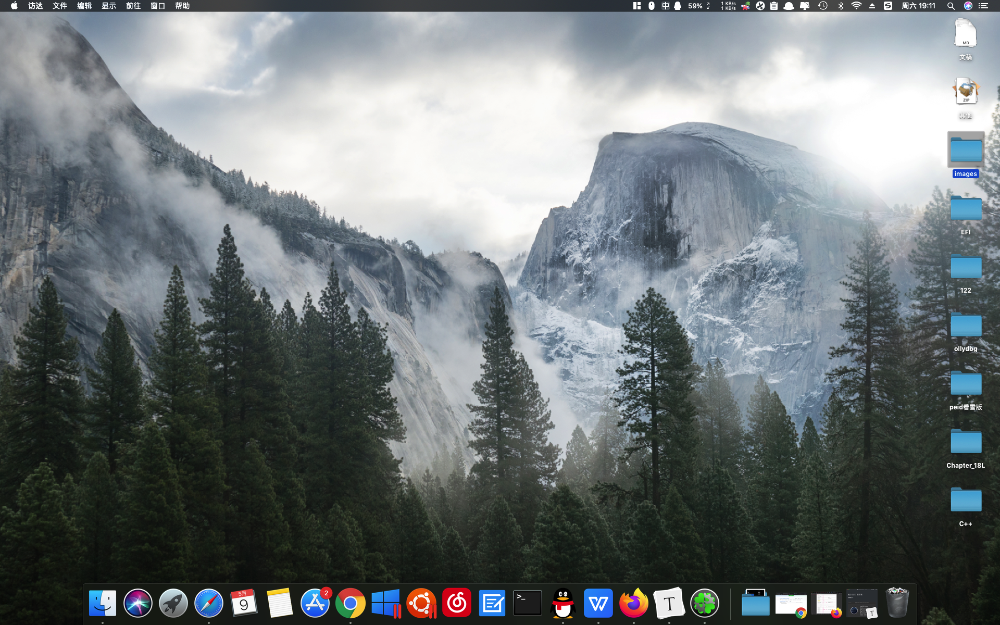
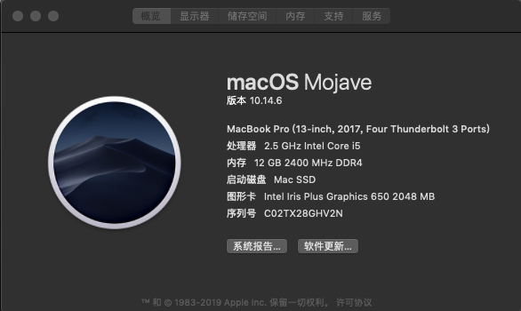

# 戴尔5577 黑苹果

感谢[黑果小兵大佬](https://blog.daliansky.net)的博客

## 详情如下：

CPU：i5-7300HQ

内存：4G 2400MHz海力士/8G 2400MHz 三星

硬盘：250G 970 EVO M.2

网卡：DW1820A 博通

显卡：核显/GTX 1050 (屏蔽)

问题：

1.HDMI输出音频的电流

2.可能关机(刚安装的一段时间有，目前没遇见)

3.睡眠问题，无法键盘鼠标唤醒

4.外接HDMI可能无法进入Clover开机

5.个人原因：懒得折腾

